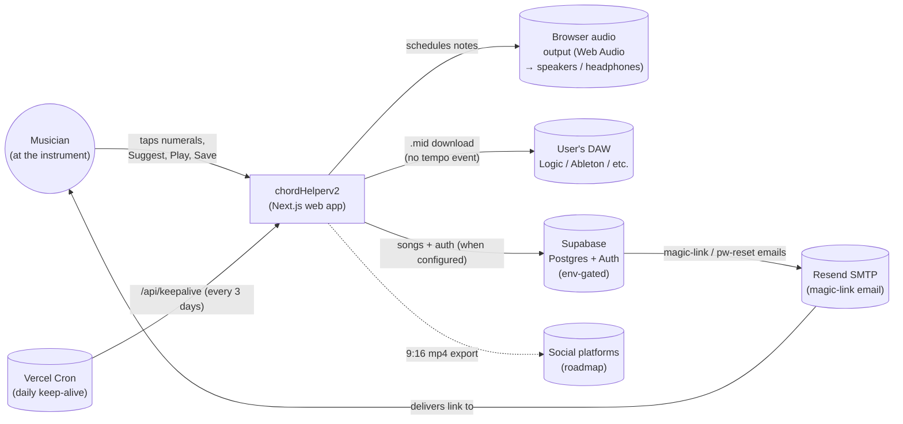
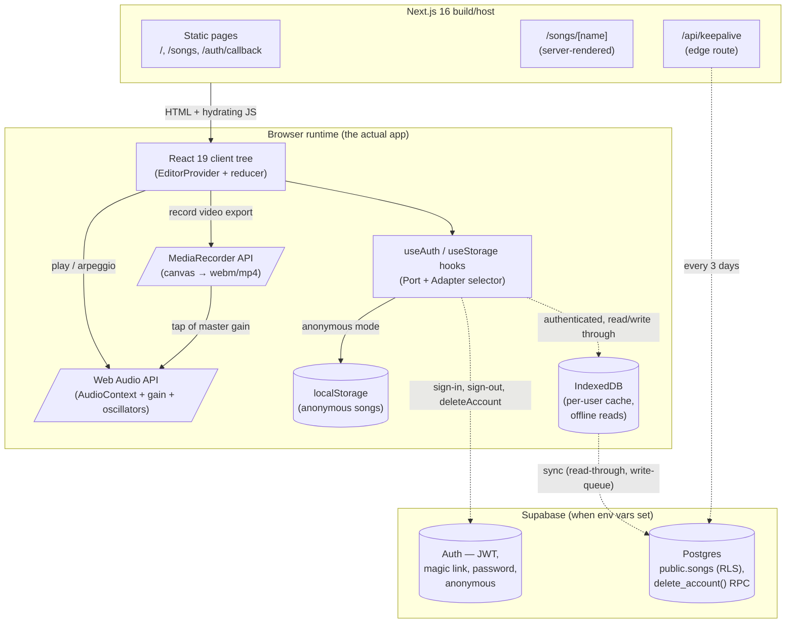
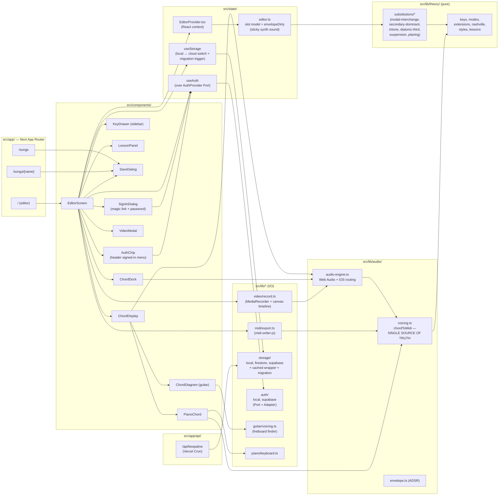
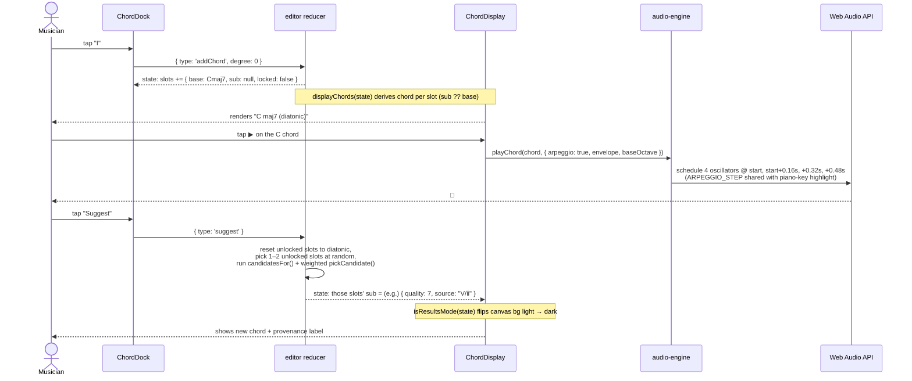

# SYSTEM.md — Visual Architecture & Design Decisions

A picture of how the app is wired together: what runs where, which external services we
talk to, how the music data flows from a tap to a sound, and the load-bearing technical
decisions behind the current shape.

Companion to **[ARCHITECTURE.md](./ARCHITECTURE.md)** (text-only as-built module map) and
**[docs/roadmap/](./roadmap/)** (where the system is headed).

Diagrams use **Mermaid** — GitHub renders them inline, they diff cleanly in PRs, and they
sit next to the code they describe. (Mermaid's native C4 syntax is experimental and
auto-layout flaky, so we use the well-supported `flowchart` and `sequenceDiagram` forms
arranged in the C4 *shape* — Context → Container → Component → Flows.)

---

## Elevator pitch

A songwriting tool: type a chord progression in Nashville numbers (I–VII) for any of the
12 keys, see the real chords, ask **Suggest** for theory-correct substitutions (modal
interchange, secondary dominants, tritone, planing, …), and **Play** them through a
browser-native synth. Save progressions locally (or to Firestore when configured), export
to a `.mid` file for Logic/Ableton, or record a shareable 9:16 video. The app is a thin
React layer on top of pure, unit-tested theory + audio modules.

---

## C4 Level 1 — System Context

Who and what the system talks to.

**Notes**
- The musician runs the app in a browser on their phone or laptop — the app has **no
  bespoke backend**; Next.js serves static pages and the only "service" call is the
  optional Supabase SDK from the browser.
- The DAW relationship is one-way (we export, they consume) — there's no MIDI input.
- **Resend** is the SMTP provider Supabase Auth uses to send magic-link + password-reset
  emails. Swapping providers is a Supabase-dashboard change, not a code change (ADR-007).
- **Vercel Cron** hits `/api/keepalive` every 3 days to keep the Supabase free-tier
  project from auto-pausing after 7 days of inactivity (ADR-008).
- Legacy: the Firebase Firestore adapter still lives in `src/lib/storage/firestore.ts`
  for backwards compatibility; Supabase is the primary path from now on.
- Social platforms are dashed: the video file exists today but the share integrations
  are on the [roadmap](./roadmap/04-social-share-integrations.md).

---

## C4 Level 2 — Containers

What's running inside the app, and where the boundaries are.

**Notes**
- There is **no API layer of our own**. The browser talks directly to Supabase via
  `@supabase/supabase-js`. The only Next.js server route is `/api/keepalive`, which is a
  cron handler the app itself doesn't depend on.
- `MediaRecorder` taps the synth's master gain node via `createMediaStreamDestination`,
  so the exported video has the same sound the user heard.
- The Web Audio container is also where the **iOS audio-session routing** lives — it
  flips `navigator.audioSession.type = 'playback'` so the ring/silent switch doesn't
  mute the synth. See ADR-006.

---

## C4 Level 3 — Components

The shape of `src/`. Pure modules (no React imports) on the left, React layer on the
right, routes at the top.

**The one rule that holds the audio layer together:** `chordToMidi` (in `voicing.ts`) is
the single source of voicing truth. The synth, the piano diagram, and the MIDI export
all consume it — change a voicing in one place and the user hears it, sees it on the
piano, and gets it in the exported `.mid`. See ADR-002.

---

## Sequence — taps to sound

The hottest path: a user adds chords, plays one, then asks for a substitution.

The same `playChord` shape is used by every play path: single-chord ▶ (arpeggio), whole-
progression Play (block chords at bpm via `playProgression`), and the silent timing pulse
used by the piano-key highlight.

---

## Services & boundaries

Every external surface, with what we use it for and what happens when it's not there.

| Service | Used for | Where invoked | Fallback when absent | Required env |
|---|---|---|---|---|
| **Web Audio API** | Synth playback (lazy `AudioContext`, ADSR voices), MediaRecorder tap | `src/lib/audio/audio-engine.ts` | No sound (visual UI still works) | Browser support |
| **iOS `navigator.audioSession`** | Route Web Audio through the **media** channel so the silent switch doesn't mute it | `audio-engine.ts` → `primeAudioForMobile()` | Old iOS: silent switch still mutes; we live with it | iOS 16.4+ |
| **MediaRecorder API** | 9:16 video export of a played progression | `src/lib/video/record.ts` | Show alert; export disabled | Browser support |
| **`localStorage`** | Default song persistence (key `chordhelper.songs`); section open/closed (`chordhelper.section.*`); beta-banner dismissal | `src/lib/storage/`, `CollapsibleSection`, `BetaBanner` | Memory-only (lost on reload); UI degrades silently | Browser support |
| **Firebase Firestore** | Optional cloud song sync (collection `songs`) | `src/lib/storage/` (env-gated) | localStorage takes over | `NEXT_PUBLIC_FIREBASE_*` (6 vars) |
| **`tonal`** | Music-theory primitives (scales, intervals, note spelling) | `src/lib/theory/*` | n/a — bundled | npm dep |
| **`midi-writer-js`** | Standard MIDI File (SMF) generation for `.mid` export | `src/lib/midi/export.ts` | n/a — bundled | npm dep |
| **GSAP** | One animation: the empty-state title intro fade | `src/components/Editor/EditorScreen.tsx` | n/a — bundled (could be replaced with CSS) | npm dep |
| **Next.js 16 / React 19** | Routing, RSC + client islands, hydration | `src/app/*` | n/a | npm dep |

---

## ADR-001 — Native Web Audio (no Tone.js)

**Decision.** Implement the synth directly against `AudioContext`, `OscillatorNode`, and
`GainNode` rather than pulling in Tone.js.

**Why.** Our needs are narrow — schedule a few oscillators with an ADSR envelope, no
filters/effects, no transport. Tone.js would add a noticeable bundle and a layer we'd
have to relearn for any change. The 60-line voice scheduler in
`src/lib/audio/audio-engine.ts` is small enough to read in one sitting.

**Consequence.** We own the iOS unlock dance (`primeAudioForMobile`, visibility-change
resume) and the autoplay-policy gating (lazy context creation on user gesture). All
documented and tested.

---

## ADR-002 — `chordToMidi` is the single voicing source

**Decision.** Make `chordToMidi(chord, { level, voicing })` in `src/lib/audio/voicing.ts`
the **only** place where "a chord becomes specific MIDI notes." The synth, the piano
diagram, and the MIDI export all call it.

**Why.** Voicing decisions (which inversion? drop-2? open? at what octave?) ripple into
three different presentations of the same chord. If they diverged we'd hear one voicing,
see another on the piano, and export a third to the DAW — confusing and wrong.

**Consequence.** Voicing variants (close / 1st & 2nd inversion / drop-2 / open / octave-
up) are one ordered list, cycled per chord. Any future change to voicing math is a
single-file edit that updates all three surfaces atomically.

---

## ADR-003 — MIDI export writes no tempo event

**Decision.** `progressionToMidi` emits a single track with note-on/off events at the
correct ticks, but **no `FF 51` tempo meta event**.

**Why.** Note order and spacing are stored in ticks relative to the file's PPQ
(`division`), independent of tempo. The tempo meta only maps ticks → seconds. We omit
it so nothing overrides the user's project tempo when they drag the `.mid` into
Logic/Ableton/etc. — they still hear chords land on the correct beats at *their* BPM.

**Why not "advisory only".** There is no advisory-only flag in the SMF spec; whether a
file's tempo overrides project tempo is the DAW's call (Logic's Project-Tempo mode,
Ableton's clip import, Pro Tools' prompt). Best to write no opinion at all.

**Consequence.** Empty MIDI export is fixed at 2-beats-per-chord; could be made
configurable (½ / 1 / 2 bars) later. Verified with a hex dump that exports omit `FF 51`.

---

## ADR-004 — Slot model (`base + sub + locked`) over input-vs-results

**Decision.** Each progression position is a `ChordSlot { base, sub, locked }`. The
displayed chord is `sub ?? base`. "Suggest" mutates `sub` on 1–2 unlocked slots; per-
chord controls (swap, lock, revert) operate on individual slots.

**Why.** The legacy app had a global "input vs results" toggle that re-rolled
everything. We wanted *gentle* re-rolls — change 1–2 chords, leave the rest, let the
user lock the ones they like and Suggest again. That requires per-position state, not
a global mode.

**Consequence.** The light → dark canvas shift (the legacy "results" cue) becomes a
derived signal: `isResultsMode(state)` returns true if **any** slot has a `sub`. No mode
flag to forget to set/clear.

---

## ADR-005 — Local-first storage, optional cloud (Supabase) via env

**Decision.** `useStorage()` returns the local provider for anonymous /
signed-out / loading states and an IndexedDB-cached Supabase provider once a
user is authenticated. All providers implement the same `StorageProvider`
Port. The original Firestore adapter remains for backwards compatibility.

**Why.** The app is useful from minute one without configuration — write a
progression, save it, come back to it. Cloud sync becomes available the
moment a user wants their songs across devices. We frame it as a benefit
("keep your songs across devices") rather than an account-creation wall.

**Consequence.** Anonymous users keep working entirely on-device. On first
sign-in, `migrateLocalToCloud` upserts their local songs into the cloud
without clobbering rows that already exist there (e.g. edits made on
another device). After sign-in, IndexedDB serves reads while offline; writes
queue locally and flush on the next list().

---

## ADR-006 — iOS audio session routed to playback, not ambient

**Decision.** When we lazily create the `AudioContext`, call `primeAudioForMobile()` to
set `navigator.audioSession.type = 'playback'` (iOS 16.4+), kick a one-sample silent
buffer, and bind a `visibilitychange` listener that resumes the context when the tab
returns to the foreground.

**Why.** iOS defaults Web Audio to the **ambient** session, which routes through the
ringer and is muted by the silent switch. Musicians use this app at the instrument and
will sometimes have the phone on silent — they should still hear the synth (which is
the whole point of the tool). `audioSession = 'playback'` puts us on the **media**
channel, same as a music player.

**Consequence.** Pre-iOS 16.4 devices still go through the ringer (we no-op silently);
all later versions get the right behaviour. The silent-buffer trick belt-and-braces the
context unlock on the first gesture. See `src/lib/audio/audio-engine.test.ts`.

---

## ADR-007 — Auth provider via Port + Adapter (Supabase chosen, swappable)

**Decision.** Define an `AuthProvider` Port in `src/lib/auth/types.ts` and
implement adapters per backend. Today: `LocalAuthAdapter` (anonymous-only,
no env) and `SupabaseAuthAdapter` (lazy-loaded when
`NEXT_PUBLIC_SUPABASE_*` env vars are set). Components only consume the
`useAuth()` hook over the Port — never the adapter directly.

**Why.** Portability was the highest-weighted goal in `AUTH-RESEARCH.md`.
Postgres is the lingua franca of databases; Supabase Auth uses standard
JWTs; the rest of our app's auth surface is small enough that a future
adapter swap is hours of work, not days. The Port hides provider-specific
quirks (URL fragment vs query-string magic links, SDK initialisation
shapes, error code mappings) behind a single interface.

**Consequence.** Anonymous sign-in works in both modes — local mode persists
a per-device UUID in `localStorage`; Supabase mode uses
`signInAnonymously()` which produces a `is_anonymous` JWT. Email sender is
configured at the Supabase dashboard level (Resend today, swappable to
SendGrid/Postmark/SES without code change). See `docs/SUPABASE-SETUP.md`.

---

## ADR-008 — Vercel Cron keep-alive for Supabase free tier

**Decision.** Add a `vercel.json` cron entry that pings `/api/keepalive`
every 3 days at 06:00 UTC. The route runs a trivial `select` against a
`public.keepalive` view so the Supabase free-tier project doesn't auto-pause
after 7 days of inactivity.

**Why.** Supabase pauses free-tier projects after a week of zero queries.
For a personal/early-stage app this can happen on a quiet weekend and break
sign-in until the maintainer manually wakes the project. A cron query
inside Vercel's free Hobby cron quota costs nothing and keeps the project
warm forever.

**Consequence.** When we leave the free tier this becomes optional (paid
projects don't pause). The route itself is authorised via the
`x-vercel-cron` header for the scheduled hit and a `CRON_SECRET` query for
manual testing — no sensitive work happens inside, so it's not a real
security boundary.

---

## ADR-009 — Sticky synth sound

**Decision.** Track `envelopeDirty` on the editor state. Once the user
touches the envelope or mix, `setStyle` (genre click) no longer overwrites
the synth sound — it still updates substitutions, weights, and extensions.
`loadSong` resets the flag, because a saved song's audio settings are the
new canonical sound.

**Why.** Users dial in a sound they like, then explore different
suggestion behaviours via the genre buttons. Resetting the synth on every
genre click is destructive.

**Consequence.** Songs save their full audio settings (`envelope`, `bpm`,
`octave`, `style`) so the saved-song view sounds the same as the editor
did when saved.

---

## Known boundaries & limitations

- **No auth** — Firestore mode is open to any visitor of the deployed app. See the
  [DB & auth roadmap entry](./roadmap/01-database-and-auth.md).
- **No CI/CD configured** — local-only quality gates (`npm run test:run`, `lint`,
  `build`, husky pre-commit). A Vercel deploy + GitHub Action is roadmap item
  [05-deploy-to-vercel.md](./roadmap/05-deploy-to-vercel.md).
- **No server endpoints of our own** — everything is browser-side, including the
  Firestore SDK calls. This is by design; if we add e.g. licensed-content lookups,
  that introduces our first route handler.
- **Whole-progression piano highlight** doesn't fire (only single-chord ▶ does).
  Tracked in ARCHITECTURE.md "Known limitations".
- **Typekit "miller-banner"** font is stubbed with the free Playfair Display via
  `next/font`. Swap in the licensed kit when we deploy under a paid domain.

---

## Maintenance

When the architecture changes meaningfully, update **both** this file (visual + ADRs)
and `ARCHITECTURE.md` (text module map). New load-bearing decisions get a new ADR
section here (`ADR-007 — …`), not just a code comment.
